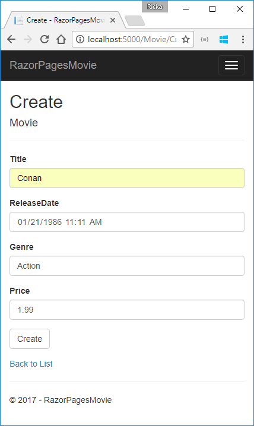

# Adding a model to a Razor Pages app

By [Rick Anderson](https://twitter.com/RickAndMSFT)

In this section you add some classes for managing movies in a database. You use these classes with the [Entity Framework Core](https://docs.microsoft.com/ef/core) (EF Core) to work with a database. EF Core is an object-relational mapping (ORM) framework that simplifies the data-access code that you have to write.

The model classes you'll create are known as POCO classes (from "plain-old CLR objects") because they don't have any dependency on EF Core. They just define the properties of the data that are stored in the database.

In this tutorial you write the model classes first, and EF Core creates the database. An alternate approach not covered here is to generate model classes from an already-existing database. For information about that approach, see [ASP.NET Core - Existing Database](https://docs.microsoft.com/ef/core/get-started/aspnetcore/existing-db).

## Add a data model

In Solution Explorer, right click the **RazorPagesMovie** project > **Add** > **New Folder**. Name the folder *Models*.

Right click the *Models* folder > **Add** > **Class**. Name the class **Movie** and add the following properties:

[!code-csharp[Main](razor-pages-start\sample\RazorPagesMovie\Models\MovieNoEF.cs?name=MovieNoEF)]

The `ID` field is required by the database for the primary key. 

### Add a database context class

Add a `DbContext` derived class to the *Models* folder.

[!code-csharp[Main](razor-pages-start\sample\RazorPagesMovie\Models\MovieNoEF.cs?name=MovieNoEF)]

The preceding code creates a `DbSet` property for the entity set. In Entity Framework terminology, an entity set typically corresponds to a database table, and an entity corresponds to a row in the table.

### Add a database connection string

Add a connection string to the *appsettings.json* file.

[!code-json[Main](razor-pages-start\sample\RazorPagesMovie\appsettings.json?highlight=11)]

###  Register the database context

Register the database context with the [dependency injection](xref:fundamentals/dependency-injection) container in the *Startup.cs* file.

[!code-csharp[Main](razor-pages-start\sample\RazorPagesMovie\Startup.cs?name=ConfigureServices&highlight=3-6)]

Build the project to verify you don't have any errors.


## Add scaffold tooling and perform initial migration

In this section you'll use the Package Manager Console (PMC) to:

* Add the Visual Studio web code generation package. This package is required to run the scaffolding engine.
* Add an initial migration.
* Update the database with the initial migration.

From the **Tools** menu, select **NuGet Package Manager > Package Manager Console**.

  

In the PMC, enter the following commands:

```PMC
Install-Package Microsoft.VisualStudio.Web.CodeGeneration.Design -Version 2.0.0-rtm-26452 -Pre
Add-Migration Initial
Update-Database
```

The `Add-Migration` command generates code to create the initial database schema. The schema is based on the model specified in the `DbContext`(In the *Modes/MovieContext.cs file). The `Initial` argument is used to name the migrations. You can use any name, but by convention you choose a name that describes the migration. See [Introduction to migrations](xref:data/ef-mvc/migrations#introduction-to-migrations) for more information.

The `Update-Database` command runs the `Up` method in the *Migrations/\<time-stamp>_InitialCreate.cs* file, which creates the database.


### Scaffold the Movie model

* Open a command window in the project directory (The directory that contains the *Program.cs*, *Startup.cs*, and *.csproj* files).
* Run the following command:

  ```console
  dotnet aspnet-codegenerator razorpage -m Movie -dc MovieContext -udl -outDir Pages/Movie
  ```

The following table details the ASP.NET Core code generators parameters:

| Parameter               | Description|
| ----------------- | ------------ |
| -m  | The name of the model. |
| -dc  | The data context. |
| -udl | Use the default layout. |
| -ourDir | The relative output folder path to create the views. |

Use the `h` switch to get help on the `aspnet-codegenerator razorpage` command:

```console
dotnet aspnet-codegenerator razorpage -h
```

<a name="scaffold"></a>
### Test the scaffold app

* Run the app and append `/Movie` to the URL in the browser (`http://localhost:port/movie`).
* Test the **Create** link.

 

* Test the **Edit**, **Details**, and **Delete** links.

If you get the following error, verify you have run migrations and updated the database:

```
An unhandled exception occurred while processing the request.

SqlException: Cannot open database "DB name" requested by the login. The login failed.
Login failed for user 'user name'.
```


## Additional resources

* [Tag Helpers](xref:mvc/views/tag-helpers/intro)
* [Globalization and localization](xref:fundamentals/localization)


>[!div class="step-by-step"]
[Previous Getting Started](razor-pages-start.md)
<!--
[Next Working with SQL](working-with-sql.md)    
-->
